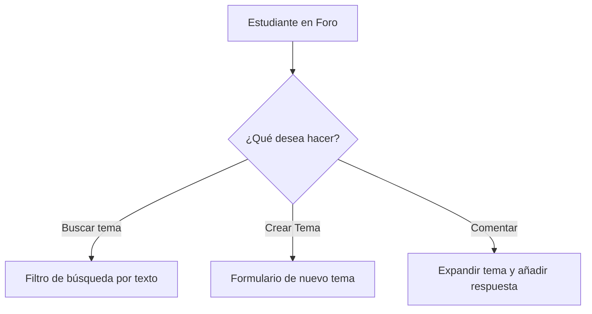

# Manual de Usuario - Plataforma Académica Assura

¡Bienvenido al **Manual de Usuario de Assura**! Este documento detalla el funcionamiento de la plataforma, diseñada específicamente para el acompañamiento y tutoría académica de estudiantes de **Ingeniería de Sistemas**. 

Assura combina la comunicación en tiempo real entre estudiantes y asesores con el poder de un asistente de Inteligencia Artificial (Assura IA) capaz de resolver y generar ejercicios de ciencias básicas y especializadas, además de brindar soporte socioemocional ante el estrés académico.

---

## Índice
1. [Introducción y Objetivos](#1-introducción-y-objetivos)
2. [Roles de Usuario](#2-roles-de-usuario)
3. [Módulo de Autenticación y Gestión de Cuentas](#3-módulo-de-autenticación-y-gestión-de-cuentas)
4. [Guía de Funcionalidades para Estudiantes](#4-guía-de-funcionalidades-para-estudiantes)
   - [Dashboard Principal](#dashboard-principal-estudiante)
   - [Foro de la Comunidad](#foro-de-la-comunidad)
   - [Chat de Asesorías en Tiempo Real](#chat-de-asesorías-en-tiempo-real)
   - [Asistente Académico Assura IA](#asistente-académico-assura-ia)
5. [Guía de Funcionalidades para Asesores](#5-guía-de-funcionalidades-para-asesores)
   - [Gestión de Asesorías y Materias](#gestión-de-asesorías-y-materias)
   - [Bandeja de Entrada en Tiempo Real](#bandeja-de-entrada-en-tiempo-real)
   - [Panel de Analíticas y Monitoreo (BERT)](#panel-de-analíticas-y-monitoreo-bert)
6. [Guía de Ejecución Técnica y Despliegue](#6-guía-de-ejecución-técnica-y-despliegue)
7. [Solución de Problemas Frecuentes](#7-solución-de-problemas-frecuentes)

---

## 1. Introducción y Objetivos

**Assura** es una plataforma educativa orientada a disminuir la deserción académica y mejorar el rendimiento de los estudiantes en la carrera de Ingeniería de Sistemas. 

### Objetivos Clave:
*   **Conexión Directa:** Vincular a estudiantes con asesores capacitados en materias críticas.
*   **Aprendizaje Autónomo:** Ofrecer un motor de IA que explique temas y genere ejercicios resueltos paso a paso en tiempo real.
*   **Comunidad Activa:** Fomentar la discusión académica mediante un foro estudiantil interactivo.
*   **Monitoreo del Bienestar:** Analizar las necesidades e inquietudes de los estudiantes para una intervención oportuna.

---

## 2. Roles de Usuario

La plataforma maneja dos tipos de perfiles claramente diferenciados:

| Rol | Descripción | Funcionalidades Principales |
| :--- | :--- | :--- |
| **Estudiante** | Usuario que busca apoyo académico y socioemocional. | Consulta a la IA, participa en el foro, busca asesores en línea y chatea con ellos. |
| **Asesor** | Tutor o docente encargado de orientar y resolver dudas. | Registra sus asesorías y materias, atiende chats en tiempo real y visualiza analíticas de consultas IA de los estudiantes. |

---

## 3. Módulo de Autenticación y Gestión de Cuentas

El sistema asegura el acceso protegido mediante tokens web JSON (JWT). Cuenta con interfaces animadas y dinámicas para los siguientes flujos:

### A. Registro de Cuentas
1. Acceda a la pantalla principal y seleccione **Registrarse**.
2. Complete la información básica requerida:
   *   Nombres y Apellidos.
   *   Correo institucional.
   *   Contraseña (mínimo 6 caracteres).
   *   Carrera y Semestre (para Estudiantes).
3. Para perfiles de asesor, complete el formulario especial de registro de asesores, especificando su experiencia o áreas de especialidad iniciales.

### B. Inicio de Sesión
1. Ingrese su correo electrónico y contraseña.
2. Al iniciar sesión correctamente, la sesión se almacena de forma local (`localStorage`) permitiendo que el sistema cargue automáticamente sus datos y configure el menú adaptado a su rol.

### C. Recuperación de Contraseña
> [!NOTE]
> La recuperación de contraseñas hace uso de un servidor SMTP configurado para enviar correos automáticos mediante Gmail.

1. Si olvidó su clave, haga clic en **¿Olvidaste tu contraseña?** en la pantalla de ingreso.
2. Digite su correo registrado. Recibirá un enlace con un token de validez temporal en su bandeja de entrada.
3. Ingrese al enlace e introduzca su nueva contraseña para restablecer su acceso de forma segura.

---

## 4. Guía de Funcionalidades para Estudiantes

### Dashboard Principal (Estudiante)
Al ingresar a la aplicación, el estudiante visualiza un centro de mandos interactivo que incluye:
*   **Saludo Dinámico:** Ajustado según la hora local (*Buenos días, Buenas tardes, Buenas noches*).
*   **Indicadores Rápidos:** Tarjetas con la cantidad de asesores en línea, número de comentarios activos en el foro y la carrera del estudiante.
*   **Asesores Disponibles:** Listado de asesores conectados en tiempo real, detallando su nombre, materia asociada, número telefónico y un botón directo de **Contactar**.
*   **Comentarios Recientes:** Un resumen de los últimos aportes en el foro de la comunidad.
*   **Accesos Rápidos:** Botones interactivos para dirigirse directamente al foro, a la bandeja de chats o al asistente virtual.

---

### Foro de la Comunidad
Un espacio colaborativo estructurado para resolver dudas de manera pública.



#### Acciones disponibles:
1. **Buscar Discusiones:** Use la barra superior de búsqueda para filtrar temas por título o contenido en tiempo real.
2. **Crear Nuevo Tema:** Presione el botón **+ Nuevo tema**. Complete el título de la duda académica y añada una descripción detallada.
3. **Responder a un Tema:** Haga clic sobre cualquier tarjeta de discusión para desplegar el área de comentarios. Escriba su respuesta en el formulario interno y haga clic en enviar. El contador de respuestas se actualizará automáticamente.

---

### Chat de Asesorías en Tiempo Real
Permite establecer contacto directo y resolver dudas particulares con asesores académicos.

> [!IMPORTANT]
> Esta función utiliza **Pusher** para habilitar la transmisión de mensajes en tiempo real. No requiere recargar la página para recibir las respuestas del tutor.

1. **Iniciar Chat:** Desde el Dashboard, localice al asesor correspondiente y haga clic en **Contactar**. Esto creará o abrirá una conversación en la ruta `/Chatstudy`.
2. **Bandeja de Mensajes:** En la vista de chat, el estudiante podrá ver los mensajes agrupados por fecha e interactuar a través de la caja de texto inferior.
3. **Indicador de Conexión:** Si el asesor responde, la interfaz reflejará la burbuja de chat de forma instantánea.

---

### Asistente Académico Assura IA
El núcleo de soporte automatizado. El chatbot no es un simple bot de respuestas genéricas; cuenta con dos modos de operación: **Modo Inteligente (BERT/SymPy)** cuando el servidor secundario de Python está encendido, y un **Modo Local (Fallback)** para asegurar que el estudiante nunca quede sin respuesta.

#### Habilidades de Assura IA:
*   **Resolución y Explicación Matemática:** Resuelve y explica ecuaciones algebraicas, límites, derivadas e integrales paso a paso utilizando el motor de cálculo simbólico de Python (`SymPy`).
*   **Generador de Ejercicios en 11 Materias:** Genera ejercicios inéditos con soluciones colapsables paso a paso en las siguientes asignaturas:
    1.  *Álgebra*
    2.  *Cálculo*
    3.  *Física (dinámica, cinemática, electromagnetismo)*
    4.  *Programación (pseudocódigo, lógica, POO)*
    5.  *Estadística*
    6.  *Geometría*
    7.  *Álgebra Lineal*
    8.  *Matemáticas Discretas (grafos, conjuntos)*
    9.  *Bases de Datos (SQL, normalización)*
    10. *Aritmética*
    11. *Lógica*
*   **Técnicas de Estudio:** Proporciona guías de estudio estructuradas como Pomodoro, el Método Feynman o mapas conceptuales.
*   **Apoyo Socioemocional:** Ofrece consejos de respiración y motivación cuando detecta altos niveles de estrés o frustración en el mensaje del alumno.

#### ¿Cómo interactuar con el chatbot?
1. **Sugerencias Iniciales:** Si la conversación está iniciando, presione cualquiera de las burbujas de sugerencia para ver ejemplos prácticos (*"Explícame qué es una derivada"*, *"Resuelve: 3x + 6 = 15"*).
2. **Ejercicios Rápidos:** Despliegue el panel de "Ejercicios rápidos" y seleccione una materia para que la IA genere un problema práctico al instante.
3. **Solución Desplegable:** Los ejercicios generados contienen una pestaña interactiva: **Ver solución paso a paso**. Al presionarla, se despliega el procedimiento numerado y el resultado final.
4. **Historial de Consultas:** Active la barra lateral izquierda para explorar y reabrir sus consultas académicas anteriores.

---

## 5. Guía de Funcionalidades para Asesores

El perfil de Asesor está optimizado para la gestión del tutor y la visualización del estado académico de los estudiantes.

### Gestión de Asesorías y Materias
El menú **Asesorías** en el panel de asesores permite estructurar su oferta académica mediante dos pestañas:

1.  **Materias (Registro Global):** Permite registrar una nueva materia dentro de la base de datos de la plataforma (por ejemplo, *Cálculo Multivariable*, *Estructuras de Datos*).
2.  **Asesorías (Mi Perfil):** El asesor vincula su perfil a una de las materias existentes, define el **precio por hora** de su asesoría y establece si está disponible o no mediante el botón de estado (Activo/Inactivo).
    *   *Estadísticas rápidas del tutor:* El sistema muestra al instante su precio promedio por hora, la cantidad de asesorías activas y el total de materias configuradas en su catálogo.

---

### Bandeja de Entrada en Tiempo Real
Un centro de mensajería adaptado para gestionar múltiples estudiantes a la vez.
*   **Buscador Lateral:** Permite filtrar rápidamente conversaciones por nombre del estudiante o fragmentos de texto del último mensaje.
*   **Indicador de Notificación:** Al recibir un mensaje nuevo de cualquier estudiante, Pusher notifica al canal privado del asesor (`asesor-[id_asesor]`), actualizando la lista de chats sin perder el foco de la pantalla.
*   **Agrupador de Fechas:** Las burbujas de conversación se agrupan cronológicamente por día, facilitando la legibilidad en hilos extensos.

---

### Panel de Analíticas y Monitoreo (BERT)
Ubicado en el menú **Chatbot IA** para el Asesor. Este panel no es de mensajería, sino un panel de **Business Intelligence (BI) y Monitoreo** para que los tutores comprendan las necesidades y la salud emocional de la comunidad estudiantil.

```
+-------------------------------------------------------------------------+
|                  PANEL DEL ASESOR - CHATBOT IA (BERT)                  |
+-------------------------------------------------------------------------+
|  [ Total Consultas: 154 ] [ Estudiantes: 42 ] [ Confianza BERT: 94% ]   |
+-------------------------------------------------------------------------+
|  Distribución por Categorías:                                           |
|  - Metodología de Estudio  [████████████████████████░░░░░░░░░░] 60%      |
|  - Estrés o Presión        [████████░░░░░░░░░░░░░░░░░░░░░░░░░░] 20%      |
|  - Dificultades Académicas [██████░░░░░░░░░░░░░░░░░░░░░░░░░░░░] 15%      |
+-------------------------------------------------------------------------+
|  Top Estudiantes Activos:                                               |
|  1. Juan Pérez    (85 consultas)  -> Categoria: Metodologia [Nivel Alto]|
|  2. María Gómez   (14 consultas)  -> Categoría: Estrés      [Nivel Medio] |
+-------------------------------------------------------------------------+
```

#### Métricas y Herramientas del Panel:
*   **Tarjetas de Resumen:** Muestra el número acumulado de mensajes procesados por la IA, la cantidad de estudiantes únicos y el porcentaje de precisión/confianza promedio del motor NLP.
*   **Distribución por Categoría:** Gráfico de barras horizontales en tiempo real de las 5 categorías del modelo BERT:
    1.  *Metodología de Estudio* (Técnicas de aprendizaje).
    2.  *Dificultades Académicas* (Vacíos conceptuales, errores).
    3.  *Orientación Académica* (Plan de estudios, prerrequisitos).
    4.  *Estrés o Presión Académica* (Salud mental, ansiedad).
    5.  *Solicitud de Asesoría* (Derivación a tutor humano).
*   **Actividad Semanal:** Gráfico de barras verticales con el flujo de mensajes recibidos día a día en la última semana.
*   **Tabla de Consultas Detallada:** Un log en vivo de todas las interacciones de los estudiantes con la IA. Al hacer clic en un registro, se abre una ventana modal con el mensaje exacto, la respuesta que recibió y la categoría en que fue clasificado.
*   **Top Estudiantes Activos:** Lista ordenada de los alumnos con mayor cantidad de interacciones del bot, su categoría más consultada, y una etiqueta de nivel (*Alto*, *Medio*, *Bajo*) para identificar qué alumnos requieren atención prioritaria de bienestar o consejería.

---

## 6. Guía de Ejecución Técnica y Despliegue

Para poner en marcha la suite completa de Assura en un entorno de desarrollo local, siga estos pasos:

### 1. Requisitos del Sistema
*   Node.js (v14 o superior) instalado.
*   Python (3.8 o superior) para el motor de Inteligencia Artificial.
*   PostgreSQL configurado y en ejecución.

### 2. Estructura de Variables de Entorno (`.env`)

#### En la raíz del proyecto (Configuración Frontend y General):
```env
# Clave JWT
JWT_SECRET=SuClaveSecretaParaFirmarTokens

# Correo de Soporte y Envío de Correos (SMTP)
GMAIL_USER=soporteassura@gmail.com
GMAIL_PASS=qsqprzamzlbkxixr

# URL de Conexión de Servidores
FRONTEND_URL=http://localhost:5173
VITE_BACKEND_URL=http://localhost:3001

# Credenciales de Pusher (Canal de mensajería en tiempo real)
PUSHER_APP_ID=2113838
PUSHER_KEY=76e3f9405cf16a0f3709
PUSHER_SECRET=1ebdeeb04f6ea168a6da
PUSHER_CLUSTER=mt1

VITE_PUSHER_KEY=76e3f9405cf16a0f3709
VITE_PUSHER_CLUSTER=mt1
```

#### En el directorio `/backend/.env` (Configuración de Base de Datos):
```env
DB_HOST=localhost
DB_PORT=5432
DB_NAME=nombre_de_su_base_de_datos
DB_USER=usuario_postgres
DB_PASSWORD=contrasena_postgres
```

### 3. Comandos de Inicio

Abra **tres terminales separadas** para ejecutar los tres componentes indispensables:

*   **Terminal 1 - Servidor Backend (Express):**
    ```bash
    cd backend
    npm install
    node index.cjs
    ```
    *Puerto asignado:* `http://localhost:3001`

*   **Terminal 2 - Cliente Frontend (React + Vite):**
    ```bash
    npm install
    npm run dev
    ```
    *Puerto asignado:* `http://localhost:5173`

*   **Terminal 3 - Motor de IA (Python / FastAPI):**
    ```bash
    cd chatbot-ia
    pip install -r requirements.txt
    start.bat
    ```
    *Puerto asignado:* `http://localhost:8000`

---

## 7. Solución de Problemas Frecuentes

> [!WARNING]
> Recuerde levantar siempre el backend antes que el frontend para evitar errores de conexión inicial en los componentes de React.

### ❌ "Error al conectar con la Base de Datos" o "el Backend no inicia"
1. Asegúrese de que el servicio de PostgreSQL esté activo en su sistema operativo.
2. Corrobore que las credenciales en `backend/.env` coinciden exactamente con su usuario y contraseña locales de PostgreSQL.
3. Valide que la base de datos y las tablas (`chats_conversacion`, `chat_mensaje`, `chats_notificacion`) estén creadas.

### ❌ "El chat no actualiza los mensajes en tiempo real"
1. Revise la consola del navegador presionando `F12`. Si visualiza errores de conexión con Pusher, verifique que las claves en el `.env` raíz sean idénticas.
2. Ingrese a la consola web de Pusher (`dashboard.pusher.com`) en la aplicación `2113838` y use la herramienta "Debug Console" para enviar un mensaje de prueba y comprobar si el evento es capturado correctamente.

### ❌ "El Chatbot IA responde en 'Modo Local' o da respuestas muy sencillas"
1. Verifique si la terminal de Python en `/chatbot-ia` se encuentra activa y escuchando en el puerto `8000`.
2. Observe el indicador del estado de conexión de la IA en la barra superior del Chat del Estudiante. Si marca "Modo local activo", significa que el frontend no logró establecer comunicación con la API de FastAPI y redirigió las consultas al motor alternativo interno en Javascript para garantizar el servicio.

---

*Manual redactado para la comunidad de estudiantes y tutores de **Assura**. Para soporte técnico adicional, contacte al equipo de administración a través de soporteassura@gmail.com.*
